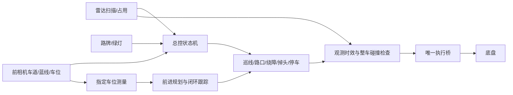

# 本轮实现与验证

本轮沿用用户确认的赛规和地图，另将两张路线图中的三个红色线路做成可重复的米制离线场景。源码直接在 Nano 工作区修改；未启动底盘，未做实车运动验收。

## 框架与实现

保留现有单总控结构：相机／雷达观测 → 总控事件和状态 → 单一行为建议 → 安全检查 → 执行桥。没有新增导航框架、硬件依赖或另一套整车入口。



- 根 README 收敛到同一个整车脚本，更新实际参数和停车模式说明。
- 直行到达配置距离后等待不同新鲜图像帧确认出口；出口缺失时停止，等待超时进入故障状态。
- 绕障完成不再永久豁免雷达保护；已完成障碍与后续不同障碍分开记录。碰撞检查使用原始扫描，目标形状过滤只决定是否触发绕障。
- 侧方停车增加独立场景生产器：将相机相对车位反算为固定车位坐标下的车辆位姿，结合雷达占用、覆盖及时间戳，再更新停车任务。指令估算位姿不能冒充测量来源。
- 按用户最新确认，P1–P5 默认统一使用 `forward_plan`：前摄测量、全前进规划、观测闭环跟踪和多帧入位确认，复用现有场景、规划器和 Follower。原倒车模式保留为显式选择。
- 相邻同类车位只有在初始完整图像中测到、且雷达确认 FREE 时才加入可行驶区域；每次新观测重新检查占用。目标、道路及邻车位均使用名义尺寸，UNKNOWN／OCCUPIED 邻位从区域中移除。跨越停车白线可能按赛规扣分，规划可行不等于无扣分。
- 完整邻位几何与占用证据分别保存：初始 UNKNOWN 只缓存边界，不开放区域；后续新鲜 FREE 可以恢复使用。非法几何状态被拒绝，不会被解释为完整车位。
- 侧方前进终点沿车位长度居中，向道路侧偏置最多 25 mm，且不超过车身剩余侧向余量的一半；垂直车位保持居中。终点容差随车身在车位内的实际剩余空间收紧，避免跟踪器提前停止在边界之外。
- 车位检测的 31 点边线覆盖检查改为 NumPy 计算，并提前排除已验证重复车位。三车位合成图与修改前结果逐项一致，单次检测从约 852 ms 降为约 173 ms；这不等于真实摄像头的检测准确率或帧率。
- 新增 `tools/competition_sim.py` 和 `src/robot/config/course.yaml`。模拟器调用实际 Controller，按车辆配置积分，并记录首次停止、出界、碰撞或超时。

按另一条实车修复对话转达的人类要求，本轮新引入的巡线修改已撤回。巡线、共享碰撞几何、避障性能优化、录像、运动控制和消息处理由另一对话维护。撤回记录见 [other_thread_revert.md](../field_data/lane_recording_check/curve_stability_040314/other_thread_revert.md)。以上绕障改动是交接前已完成内容。本轮仅为停车接入修改总控适配器中的模式判断，消息处理交接后不再写该适配器。

## 尺寸与仿真边界

| 数据 | 当前值 | 证据类别 |
| --- | --- | --- |
| 场地 | 6 × 6 m | 原尺寸图标注 |
| 单车道宽 | 0.60 m | 原尺寸图及用户确认 |
| 道路边界半径 | 0.60／1.20／1.80 m | 原尺寸图标注，不能当作后轴轨迹半径 |
| P1—P3 | 0.70 × 0.36 m | 现有配置及用户确认 |
| P4／P5 | 0.45 × 0.38 m | 现有车位配置 |
| 轴距／车宽 | 0.26／0.24 m | 车辆软件配置，本轮未尺量 |
| 前／后悬 | 0.07／0.07 m | 车辆软件配置，本轮未尺量 |
| 速度／最大转角 | raw 20 对应估计 0.16 m/s；0.46275 rad | 配置模型，本轮未标定 |
| 蓝线、路牌、车位中心位置及线路拐点 | 见 course.yaml | 从图片推定，非现场测绘 |

图像没有为每个物体提供完整坐标，车辆速度、轮角和外参也尚未在本轮实测，因此不能声称全部数据均为真实量测值。模型保持已知尺寸，明确标注推定位置。合成观测不评估真实摄像头分割、YOLO识别、反光、延迟或打滑。

## 验证记录

主agent在 Nano 上完成以下不动车测试：

| 检查 | 结果 |
| --- | --- |
| 输入门控、直行距离、右蓝线修正、蓝线入口、连续障碍 | 49 项通过 |
| 模块归属检查 | 472 个源码／配置文件通过，参数覆盖有效 |
| 整车脚本 `bash -n` | 通过 |

最终同一轮还包含停车场景 40 项、侧方规划器 14 项、模式隔离 6 项、相机调度 12 项、
车位检测 14 项、感知 15 项、前进停车接入 2 项、前进模型闭环 6 项和模拟器 9 项。
Nano 同一轮共 **167 项通过，0 失败、0 错误、0 跳过**，耗时 56.813 s；运行期间源码／配置哈希不变，见
[targeted_tests.log](competition_implementation_20260929/targeted_tests.log) 和
[targeted_suite_source_snapshot.json](competition_implementation_20260929/targeted_suite_source_snapshot.json)。
该次测试结束后，另一对话又修改了 `lane/controller.py` 和其掉头回归测试；
167 项结果对应记录中的稳定快照，不宣称覆盖此后的巡线修改。本轮停车实现未再变化。
侧方正例使用名义道路、目标车位及一个独立 FREE 邻车位的精确矩形；按
`speed_raw × raw_to_mps × dt` 积分真实自行车模型，进入多帧确认并到达 DONE。
垂直正例同样完成闭环直进。场景测试独立验证邻位占用变化会撤除区域；无邻位的
普通侧方入口作为无路径停车负例。测试输入仍为合成观测，不能当作实车闭环验收。

交接前的私有 ROS 图接口检查通过：主控到执行桥的时间戳命令、重复发布者拒绝、手动接管、
自动急停锁存、手动输入断连停车、影子模式无真实命令发布者，见
[interfaces.log](competition_implementation_20260929/interfaces.log)。该图没有底盘订阅者；此后消息处理由另一对话维护，该记录不宣称覆盖其最新修改。
P4 前进模式的 launch 参数展开成功：`forward_plan`、指定 `P4`、转向命令尺度 0.03、后摄关闭，见
[forward_launch_params.yaml](competition_implementation_20260929/forward_launch_params.yaml)。
只执行 `--dump-params`，没有运行 launch。目录中的旧倒车参数展开仅保留为历史检查。

## 三条路线结果

最终模型配置重跑结果如下；各次运行前后记录的关键源码哈希一致。

| 路线 | 首次失败 | 仿真时间 | 参考线路偏差 | 轨迹 |
| --- | --- | --- | --- | --- |
| 图1左 | A，等待可信直行出口后持续停止 | 28.05 s | 0.2923 m | [SVG](competition_implementation_20260929/image1_left.svg) |
| 图1右 | A，同上 | 28.05 s | 0.2923 m | [SVG](competition_implementation_20260929/image1_right.svg) |
| 图2 | A，直行阶段车身角点越过圆角场地边界 | 16.85 s | 0.0809 m | [SVG](competition_implementation_20260929/image2.svg) |

完整轨迹、命令、事件状态和哈希见同目录每条路线的 JSON；汇总见
[summary.json](competition_implementation_20260929/summary.json)。灰色虚线是图片推定的参考线路，红线是当前控制器积分得到的行驶轨迹。

**三条线路均未完赛，也未到达停车事件。** 当前模拟器将同一个推定位置用于路牌可见性和蓝线入口。
图片中的 A 等标签可能对应入口，也可能表示出口／决策节点；缺少分开的路牌、入口线和出口坐标。
因此这些失败只证明当前场景假设和控制策略的组合没有通过，不能直接认定是巡线或直行算法缺陷。
后续应先核准事件位置，再据稳定场景攻关动作交接，不依据推定位置盲改实车算法。

感知为理想的 20 Hz、无延迟合成输入，实际 lane／ground 频率仅记录，没有模拟曝光、调度和消息延迟。
车位输入包含合成的明确编号及精确几何，不代表相机已经识别 P1—P5。
扫描只包含场景明确声明的圆柱；当前三路线没有断言图中黑点的实测障碍坐标。
20 cm 圆柱的射线生成由单独测试验证，后续停车、绕障及完整场景仍需独立验收。

历史全量 unittest 并非绿色：探索性运行遇到旧掉头阶段、旧巡线单位、单帧路牌及绕障豁免等预期冲突。没有删除这些测试或把该次混合版本结果当作验收通过。当前针对性测试通过只证明对应行为，不能替代整圈和实车验收。

## 仍需逐项验收

| 顺序 | 模块 | 当前实现及下一步证据 |
| --- | --- | --- |
| 1 | 尺寸与执行模型 | 名义地图已建；现场核准车身、轮角、raw 速度换算及摄像头／雷达外参，否则厘米级停车容差没有实车依据 |
| 2 | 路口事件与动作交接 | 核准路牌、入口蓝线、出口各自坐标，再复跑三条线路；当前推定场景均未完赛 |
| 3 | 前摄车位持续测量 | 完整候选锁定目标，驶入后由两条长边及远端横边恢复部分车位；需要真实录像证明视野足够且测量连续，语义编号仍须显式选定 |
| 4 | P1–P5 前进停车 | 两类几何已有模型闭环与停止门控；需分别验证侧方双弧、垂直转入、四轮入位、邻位占用变化及白线扣分。无已确认相邻空位时，普通侧方入口的保守规划仍可能无路径 |
| 5 | 整圈运行 | 巡线、避障、掉头由另一实车修复对话维护；取得稳定实车回放后验证连续事件、耗时与最终停车，不能用独立模块通过代替完赛 |

本轮未增加前进定时开环降级。现有指令估算位置用于时序关联，停车控制位置来自车位图像；实际视觉噪声、遮挡和执行偏差仍需标定及录像验证。

## 运行命令

不动车回归及模拟命令均在 Nano 执行：

```bash
cd /home/nano/robocup_ws
source /opt/ros/melodic/setup.bash
source /home/nano/robocup_ws/devel/setup.bash
export PYTHONDONTWRITEBYTECODE=1
export PYTHONPATH=/home/nano/robocup_ws/src:/home/nano/robocup_ws/src/ros/lane/src:/home/nano/robocup_ws/devel/lib/python2.7/dist-packages:/opt/ros/melodic/lib/python2.7/dist-packages
python2 tools/module_workspace.py check
python2 -m unittest discover -s src/robot/test -p 'test_parking_scene.py' -v
python2 -m unittest discover -s tools -p 'test_competition_sim.py' -v
python2 tools/competition_sim.py --route all --max-time 180 \
  --output-dir /tmp/competition_sim_review
```

下列命令会启动车辆，留给现场人员执行，未由本轮执行：

```bash
cd /home/nano/robocup_ws
source /opt/ros/melodic/setup.bash
source /home/nano/robocup_ws/devel/setup.bash
bash tools/sign_detector_20260916/run_yolo_vehicle.sh \
  parking_mode:=forward_plan parking_slot:=P4 start_rear:=false
```

侧方车位只需将 `parking_slot:=P4` 改为 `parking_slot:=P1`，仍使用 `forward_plan`。
具体编号及无编号候选的排序由现场确认；普通相机没有车位编号识别，AUTO 不能代替该选择。
前进停车不依赖后摄；路线若使用已有后摄掉头动作，可单独设置 `start_rear:=true`。
测量丢失不会自动切到开环。开环的速度和时间必须现场标定，现有独立倒车开环工具也不是前进停车的自动降级方式。

修改前快照：`/home/nano/robocup_cleanup_backups/20260929/competition_implementation_before/src_tools.tgz`。该快照用于比对本轮改动，不可整包覆盖正在由另一对话维护的文件。
