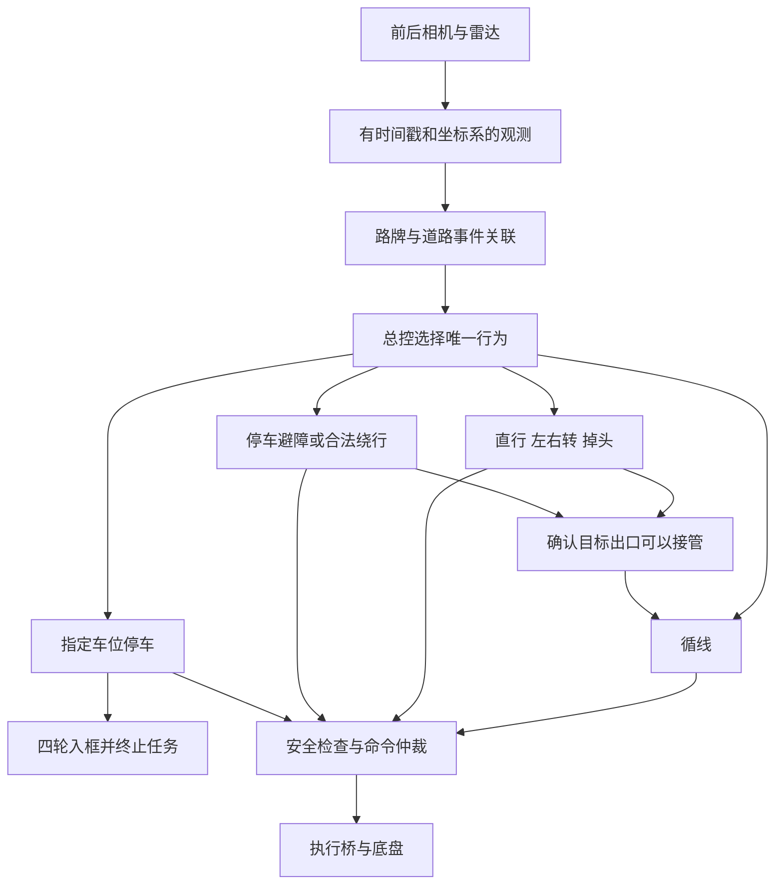

# 赛题、地图与当前整车能力审查

审查日期：2026-09-29（工作站日期；Nano 日志可能为北京时间 2026-09-30）。用户确认沿用原赛题与地图。本轮只做源代码、规则、设备枚举、配置解析和不动车测试，未修改运行算法或参数，未启动底盘。

## 结论

整车软件分层已经清楚，可以保留 `master → 行为模块 → motion/执行桥 → 底盘` 这套结构继续完善。尚未收敛的是比赛任务闭环：观测是否足够可信、路牌与入口是否正确关联、动作何时真正完成、出口是否属于目标车道、停车是否满足指定车位及四轮入框要求。

当前不能将“各模块有实现”“某套离线测试通过”解释为完整赛道已可稳定完赛。现场入口还带有明显的分段调试策略：一次定时避障、指令模型里程、固定蓝线接近时间和距离、默认前进入库。

## 1. 规则与地图边界

原归档仅含封面及印刷第1—6页。本轮从[赛事官网2025规则发布页](https://rcccaa.drct-caa.org.cn/article_info.php?id=77)下载同年1:12车型组完整规则，核对其前7页与归档内容一致。完整文件见 [rules_2025_1_12.pdf](competition_review_20260929/rules_2025_1_12.pdf)。评分页已渲染并人工视检。

规则对当前架构最重要的约束：

- 印刷第7页：标志位置、障碍物位置和数量可变。正式障碍为宽、高各20厘米的白色圆柱；此前路锥训练场景应单独验收。
- 印刷第7、11页：P1—P3为侧方车位，P4/P5为倒车入库车位；目标由停车牌指定，不能单凭哪个车位空闲来选。
- 印刷第11—12页：完成标志动作才计分，靠右行驶并避免压实线；停车以指定车位内四轮入框为准，入库后比赛结束，不要求再出库。
- 障碍前无法合法换道时可以停车等待；因此“可信停车”应先于“主动绕行”验收。具体分值及处罚以原文为准。


图中道路半径标注不能直接当作后轴转弯轨迹。P1—P3的70×36厘米和P4/P5的45×38厘米是当前配置中的车位尺寸；P1—P3尺寸此前由用户确认，但现场净宽、线宽、底盘尺寸及相机外参仍应量测。地图用来约束道路、车位及验收场景，不应编码成唯一的路牌顺序。

## 2. 当前硬件与实际入口

| 项目 | 本轮证据 | 控制边界 |
| --- | --- | --- |
| 计算平台 | `/proc/device-tree/model` 为 Jetson Nano Developer Kit；内存总量约3956MiB；Python2.7.17 / ROS Melodic环境可用 | 应测整条感知到控制链的延迟，不能只看YOLO单次推理 |
| 摄像头 | USB枚举两台Microdia摄像头，存在 `/dev/video0`、`/dev/video1` | 本轮未开摄像头，未重新验证前后对应、画面或当前标定误差 |
| 底盘 | STM32 USB串口 `/dev/ttyACM0` 存在；驱动向串口写raw速度、raw转向 | `/base_controller/status`是输出指令和串口写状态，不是实测轮速/轮角 |
| 雷达 | CP210x设备 `/dev/ttyUSB0` 存在；launch选择 `ls01b_v2` | 本轮未启动雷达，不把设备枚举等同于新鲜扫描有效 |
| 几何 | 配置轴距0.26m、车宽0.24m、前后悬各0.07m | 均是软件当前值，本轮没有尺量证明 |
| 位姿 | `pose_mode=command_model`；前后速度换算仍标为经验占位值 | 未发现已接入的真实里程反馈证据；累计距离/航向不能等同实测 |
| 存储 | Nano根分区29G，剩余约676M、占用98% | 当前入口开启循线录制；长跑前需要明确录制预算和保留策略，本轮未清理数据 |

本轮开始时ROS master不可达，未发现比赛节点运行。这里只能评价保存的程序和配置，不声称验证了活动传感器或实车轨迹。

实际入口是 `tools/sign_detector_20260916/run_yolo_vehicle.sh`。本轮只提取其参数并执行 `roslaunch --dump-params`，没有执行该动车脚本。329个展开参数与12个关键源码哈希见 [source_snapshot.json](competition_review_20260929/source_snapshot.json)。

| 参数/能力 | 实际展开值 |
| --- | --- |
| 普通循线/动作/直行速度 | raw 20 / 20 / 20 |
| GAP速度 | raw 16 |
| lookahead / action_lookahead | 1.0m / 0.30m |
| steering_command_scale_rad | 0.03 |
| 普通循线横向满幅尺度 | 0.075m |
| 蓝线入口 | 对齐窗口1秒，另前进0.36m，停车1秒 |
| 直行段 | 1.25m，采用指令估算距离 |
| 定时绕障 | 停车转向等待0.4秒、左2.6秒、右7.8秒；随后确认出口 |
| UTURN | 默认七段定时前进/倒车序列；结束后等待车道交接；相对位姿与视觉掉头未启用 |
| 停车 | `forward_center`；后摄像头不启动 |
| 路牌 | YOLO TensorRT；模型文件存在；不代表本轮识别准确率已测 |

README和部分恢复文档记载的参数已落后。普通循线现为最远路径点横向比例控制加右弯保持，并不使用Pure Pursuit选择普通循线目标；因此继续调整lookahead不能等同于修改普通循线目标选择。Pure Pursuit仍用于部分动作/边线跟踪。

## 3. 应保留的总体框架



图中的出口确认、事件关联和统一安全检查是验收要求，并非声称当前各分支已统一实现。当前已有急停、红灯、流超时、执行桥和底盘看门狗，应保留。全局建图、重型导航框架或新增硬件暂不列为前置条件；先用已知场地结构和相机/雷达相对观测完成局部任务。

建议所有动作遵守同一阶段约定：意图缓存 → 入口关联 → 接近 → 执行动作 → 目标出口确认 → 结束旧事件并允许新事件。停车的终态则是停车验收通过，直接结束比赛。

## 4. 模块缺口与逐关顺序

下列实车次数是建议工程验收门槛，不是赛规条款。所有动车命令由现场人员执行；通过上一关再扩展下一关。

| 顺序 | 模块与现状 | 本关具体工作 | 验收依据 |
| --- | --- | --- | --- |
| 0 | 版本/配置/验证记录存在差异 | 保存真实入口配置、测试结果和源码哈希；给失败测试分类；明确当前算法基线 | 本报告和快照已完成；行为测试仍有3项失败，不能宣布全绿 |
| 1 | 全局安全有基础，但绕障中和绕障后存在雷达保护豁免 | 分清“不再重复触发同一障碍”和“停止全程障碍检测”；区分自动锁停与所有输入源急停；先建立可解释的停车底线 | 离线覆盖第一次/第二次障碍、绕行中障碍、陈旧扫描、手动接管与急停优先级、红灯、超时；静止传感器验证后才允许低速现场验证 |
| 2 | 车道观测、转向映射和丢线控制尚未形成统一可信标准 | 固定当前算法做真实帧序列回放；分别测目标线选错、右锁何时进入退出、低置信度单点、虚线缺口和转向饱和；校验标定及速度/转角尺度 | 同一组直道、左弯、右弯、单线/虚线、出口偏航样本可重复；记录选线、状态、raw命令；现场每类连续5次不出线、不人工摆正 |
| 3 | 路牌识别和蓝线入口已有链路，动作交接标准不一致 | 先做“直行结束→目标出口接管”，再推广到左右转和UTURN；区分入口线、出口线、下一条事件；保留失败超时 | 重复帧不增票，同一入口只消费一次；路牌与本路口绑定；完成距离后不能在无可信出口时宣称动作成功 |
| 4 | 绕障仍为定时控制且只能一次 | 用可见实/虚线、障碍和回归空间决定停车或绕行；验证绕回靠右车道；支持后续新障碍 | 空间不足能停车；足够空间才绕；连续两个障碍均被处理；回到正确车道后才恢复普通循线 |
| 5 | P4/P5倒库有规划后端，主入口默认是前进入库 | 接通指定P牌与垂直车位关联、后视观测、倒车轨迹跟踪和四轮入框验收；确认前后运动方向及碰撞检查 | P4/P5各自可被指定；错库拒绝；新鲜后视与雷达证据；实际倒入且四轮在框内，建议各5次 |
| 6 | P1/P2/P3侧方有独立规划器，但自动三库旧链不在当前主流程 | 先补真实场景输入及指定库关联，再做占用判定和侧方动作；不能把唯一空位替代标志指令 | 三个目标库分别验证；未知/遮挡不得视为空；目标锁定后不得换库；四轮入框并正确结束 |
| 7 | 尚缺随机组合完整比赛证据 | 在前述固定版本上串联绿灯、连续标志、障碍、正确出口和指定停车；最后提速 | 建议至少3次完整、不人工接管的不同摆放运行；按规则统计实际动作成功、压线、碰撞及停车，不以FINISHED字符串代替裁判条件 |

### 关键源码依据

1. **绕障只能一次且随后关闭普通雷达检查**：`obstacle/controller.py:25`、`:69`、`:138`；`master/state_machine.py:368`。`checked_command`在定时绕行中保留扫描新鲜度，但绕过碰撞扫掠检查（`:155`）。这是当前明确策略，非本轮引入。
2. **普通循线控制与可信门槛不一致**：`lane/controller.py:23`的`lane_valid`检查点数和置信度，但`:126`的普通循线只检查新鲜度、路径非空和前向点；选最远点、横向0.075m达满幅。`test_topmost_lane.py`明确测试低置信度仍可选目标，因此应先确认/修订行为约定，不能把它当作偶发遗漏直接改掉。
3. **新鲜空路径可沿旧舵角继续**：`lane/controller.py:108`的GAP受距离/时间限制，默认0.8m/4秒、raw16；与相机流过期立即停车是两种不同情况。右弯锁还可能保留满右舵，需验证实际赛道可接受范围。
4. **直行结束缺少同样的出口门槛**：`turn/controller.py:163`达到估算1.25m立即`resume_lane`；而`obstacle/controller.py:69`已经等待`handoff_lane_confirmed`。应统一完成条件，不能仅延长盲走距离。
5. **入口是定时对齐**：`turn/controller.py:107`—`:159`对齐窗口结束即前进，记录的是`alignment_completion=timed`，不等于实际摆正。直行前进阶段已有继续修正蓝线法向，不能沿用旧文档声称所有动作都完全只保持前进段初始航向。
6. **侧方依赖真实场景消息**：`parallel_parking/controller.py:26`要求动作之后且未过期的scene；缺失时停车。当前启动链没有`/competition/parallel_parking_scene`的生产者，地面观测的slots不会自动变成此消息；`parallel_parking/planner.py:180`还要求实测位姿来源，拒绝command-model。应由视觉/雷达相对定位补齐真实输入，不能将估算值改名伪装成测量。`docs/parallel_isolation_20260929.md`确认旧`auto_p`/三库入口已退出当前主流程，普通模式不加载侧方。
7. **输出日志不是真实运动反馈**：`drivers/base/src/base_controller.cpp:127`发布最近输出raw值及串口写状态；`:199`实施0.25秒命令超时。`config/competition.yaml:14`、`:40`明确速度换算占位和`command_model`。
8. **软件急停与手动接管边界**：`master/controller_node.py:314`的`/competition/estop`锁存自动控制；`ros/manual/scripts/testloop.py:230`先处理键盘/手柄命令，再处理自动命令。此topic不能直接称作所有输入源的全局急停。本轮未验证物理断电或硬件急停能力。
9. **诊断与实际门槛不同**：`master/diagnostics.py:8`按0.5秒判断scan过期，而实际`scan_ready`使用0.8秒和末束时间戳。应统一诊断口径，避免日志误导调试。
10. **切成倒车模式仍不等于选对指定车位**：`camera/observations.py:152`的AUTO候选接受两种车位类型；`parking/planner.py:67`从空闲且可达候选中规划，没有凭模式名限定P4/P5。需要明确停车牌、物理车位、车位类型和最终入库方式之间的对应关系。
11. **UTURN仍以定时动作执行**：`config/maneuvers.yaml:13`启用七段序列；`uturn/controller.py:313`在序列完成后等待`handoff_lane_confirmed`。已有出口等待，不能说完全没有闭环；但七段运动本身和终点身份仍缺真实姿态/目标车道证据。优先用已有视觉、雷达标记修正相对姿态，并测量实际末端误差。

## 5. 本轮不动车验证

- 在Nano运行模块归属与配置检查：`PASS 452 source/config files assigned; module overrides valid`。
- 只解析实际启动脚本：329项配置展开，stderr为空；节点列表有前摄、循线、雷达、地面视觉、识别、总控、执行桥、底盘、viewer，没有后摄节点。
- 7个针对性离线测试文件最终共63项：60通过、3失败、0错误。完整输出见 [offline_tests.log](competition_review_20260929/offline_tests.log)。首次运行因覆盖PYTHONPATH导致`vehicle_control`不可导入，补齐依赖路径后重新运行；最终统计只使用第二轮。
- 通过项包括当前最远点控制、右弯保持、丢线/断流区分、任务安全和侧方隔离。
- 失败1：旧直行测试仍输入单帧低于当前阈值的路牌，并期待旧速度/流程；当前输出停车。
- 失败2：旧命令单位测试仍期待普通循线返回Pure Pursuit物理角；实际已改为横向比例命令。
- 失败3：旧循线序列测试期待每帧都为raw20，但右弯保持触发后的反向目标进入GAP输出raw16；需要区分模式隔离样本和连续序列验收。

这些失败说明当前验收约定尚未统一。前两项与旧预期冲突有直接证据；第三项涉及新状态机行为，应核对期望后再修订测试或实现。本轮没有为得到绿色结果而修改测试。

可复现的Nano端不动车测试命令（只运行unittest，不启动ROS节点）：

```bash
cd /home/nano/robocup_ws
source /opt/ros/melodic/setup.bash
source /home/nano/robocup_ws/devel/setup.bash
export PYTHONDONTWRITEBYTECODE=1
export PYTHONPATH=/home/nano/robocup_ws/src:/home/nano/robocup_ws/src/ros/lane/src:/home/nano/robocup_ws/devel/lib/python2.7/dist-packages:/opt/ros/melodic/lib/python2.7/dist-packages
python2 tools/module_workspace.py check
audit_rc=0
for suite in test_mission_safety.py test_lane_command_units.py test_lane_loss_transition.py test_legacy_lane_control.py test_parallel_isolation.py test_topmost_lane.py test_lane_right_curve_guard.py; do
  python2 -m unittest discover -s src/robot/test -p "$suite" -v || audit_rc=1
done
echo "audit_rc=$audit_rc"
```

没有进行传感器运行验收或实车运动验收，不能宣称停车、转弯、绕障或整圈成功。

## 6. 多agent分工与集成纪律

本轮以5名独立子agent分别核查总控/安全、循线/感知、停车、规则地图、离线测试，主agent复核关键代码、实际配置、规则原页和测试输出。

后续并行适合分成：相机与真实帧回放、单一行为模块、独立验证三条工作；总控状态、共享协议、转向换算和完整launch由主agent顺序集成。每轮只验证一个实际问题，保留前后对照数据。优先完成第1关和第2关，再把同一套可信输入和完成判据用于其余动作。
