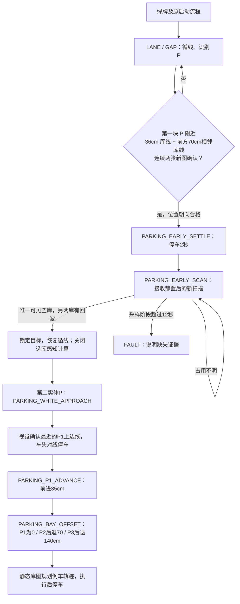

# 摄像头定位三库，停车单次雷达选库

本版用于 `auto_p + parallel_second_p_enabled`。地图行驶方向为 P3→P2→P1；每库 70×36cm。代码已同步 Nano，未启动任何动车节点。车辆当前起点的位置和朝向尚待操作者确认，因此没有修改绿牌后的原启动段。

## 状态与证据

- 已删除默认侧方流程里的“模型累计转过45°、航向暂时稳定即停车”以及固定环数组合选库。普通旧模式的环数工具保留，不作为此流程的后备猜测。
- 第一块 P 连续两帧确认后，提前启用右侧库线检测。36cm 允许端点误差±5cm，间距70cm允许±8cm，库口侧端点横向错位不超过6cm，两个横线方向差不超过6°。首线必须靠近第一块 P，且有后续相邻线，防止把 P1 末端或一根路牌边框当成起点。
- 只统计不同源时间戳的图像。库线位置在8cm内、方向在5°内匹配才累计两帧。相邻观测间隔不得超过 ground_timeout。
- 采样前车头到 P3 起始线的距离须在 -3～50cm；车身相对库排偏角不超过8°，循线数据仍须新鲜且满足原近处直线门槛。无需精确停在旧环数标定位置，横向距离由视觉参考计算。超出条件继续循线寻找；不会因为在更远处短暂走直而停车。
- 两个实体 P 均确认但尚未锁定目标时，报 `parking_first_row_not_confirmed` 并停车。这里是明确的定位失败，不会把后面的 P1 当成 P3 重新采样。
- 以视觉 P3 库口起点为原点，沿行驶方向每70cm划分 P3/P2/P1，向右36cm为库深。扫描先按雷达外参转换到这个坐标系。只使用雷达右前3m范围。
- 库内实际回波即占用，不再因“像平板”丢弃。边界附近4cm纵向、3cm横向留作定位误差带；每库18个内部采样点，至少85%被射线证实 FREE 且无库内回波才算可见空库。遮挡、NaN、视野外或超3m都不算空。仅当两个库 OCCUPIED、一个 FREE 时锁定。
- 2秒静置以指令积分位姿为依据；不是轮速反馈。只接受静置结束之后开始的扫描。第一帧明确有效的扫描锁定目标，同帧不重复计算，锁定后不再采雷达或变更目标。
- P1 阶段已确认的同一库线可由新画面小幅更新，消除一部分模型距离漂移；不接受跳到后续另一根线。画面短时缺失沿用最后参考，保留原越线、超时、执行偏差停止条件。

## 性能

- 库线 Hough 搜索从整幅宽视图缩到标定坐标中的右侧区域，排除左侧道路和远背景，最短候选段28cm。
- 此模式库线检测最高5Hz；每张图仍只处理一次。没有选库/找P1任务时停用库线检测，普通循线节点保持独立。
- 雷达采样前2秒不做点云构造；采样时仅构造原始回波和射线覆盖，跳过不用的圆/平板拟合。其余模式继续使用原分类。
- 删除未调用的跨帧路锥跟踪函数和无用的启动航向记录；不增加第三方依赖。

Nano 保存图像 `20260922_012550_5356` 的六帧，每种方法各测三次，单线程 OpenCV，库线提取平均耗时：

| 源时间戳秒尾数 | 原整图 ms | 右侧区域 ms |
| --- | ---: | ---: |
| 1558 | 122.5 | 24.2 |
| 1566 | 129.8 | 54.9 |
| 1570 | 200.8 | 7.7 |
| 1575 | 220.5 | 5.7 |
| 1580 | 101.2 | 21.9 |
| 1584 | 48.4 | 6.7 |

这些数字不包含相机解码、去畸变、透视转换和整车控制周期，不能据此声称实车已流畅。

## 验证边界

Nano Python 2 不动车回归：153项通过；模块检查448个源代码/配置文件通过。测试覆盖三种空库、横向位置与航向变化、未知/遮挡拒绝、重复图像拒绝、一次采样锁定、P1同线更新、防换线、启动流程和感知调度。同步后核对核心文件 SHA-256 一致；未重启运行中的节点，也未发送运动指令。

35张保存图像的抽样回放中，15张有通过长度/方向筛选的单根横线，但没有确认相距70cm的库线对。单根线可能来自背景或路牌，不能声称已经识别出 P3。下一次现场验证必须查看 `first_row_diagnostic` 和画面中的实际端点，核对当前相机安装、投影标定和库线可见范围。没有用无证据的尺度修改去凑36cm。

`first_row_diagnostic` 提供原始线段数、合格36cm候选数及拒绝原因；`first_row_candidate` 提供两帧确认、间距、长度；`first_row_front_gap_m / first_row_lateral_m / first_row_heading_deg` 给出车辆与库排的关系；`early_occupancy.bays` 给出每库回波数和可见空闲比例。

倒车路径仍受车辆尺寸、最大转角和实际横向距离约束。固定前进35cm不保证每个位置都有可行轨迹。里程仍为 command_model，后退70/140cm和入库执行未转为实测里程闭环。红牌、急停、循线丢失、执行偏差停止保留；锁定后不监测新增障碍物。

当前完整启动脚本仍是 `/home/nano/robocup_ws/tools/sign_detector_20260916/run_yolo_vehicle.sh`，仍保留原绿牌后1.25m启动段。起点确认前，不应把这条旧启动段当成适用于当前位置。
