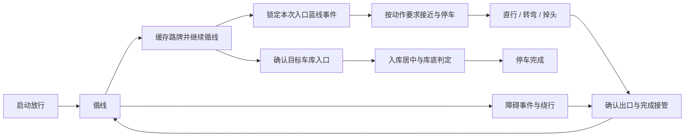

# 多赛道通用流程审查：2026-09-20 02:08～02:10 运行

本轮只读检查运行代码，并做无 ROS 节点、无执行器的控制器对照；未改动运行算法。地图是验收示例，不是固定路线配置。

用户确认的示例路线：黄色起点向上 → A → 上方弯道 → B → C → D → E → F 附近掉头 → G → 下方外圈 → H → I → J → K。K 为前进入库，上方黑点为需要避让的障碍。路线与动作入口蓝线的逐一对应仅供分析，不能写死到程序。

输入日志：`/home/hetaisheng/.codex/attachments/51cd3d4e-e45b-4f29-ba95-847ab07bb6b5/Pasted text.txt`。
输入地图：`/tmp/codex-clipboard-daeed8b7-fffa-4430-aad2-e4a0515dbf6b.png`。
对应抓拍：`field_data/sign_capture/20260920_020739_16957/`。

## 1. 最新运行证据

| 时刻 | 记录事实 | 结论 |
|---|---|---|
| 02:08:39 | 已缓存 STRAIGHT，timed_bypass_completed=true | 提供的片段没有起步和避障执行全过程，不能据此验收避障轨迹 |
| 02:08:54.417 | STRAIGHT 触发，蓝线观测前向位置约 1.031 米 | 新的识别触发已生效 |
| 02:08:56 | BLUE_STOP，累计接近距离约 0.365 米 | 前进段完成 |
| 02:08:57.318 | 停车约 1 秒后进入 STRAIGHT_DISTANCE | 独立直行段开始 |
| 02:09:04.220 | LANE / no_initial_lane，路径点为 0，直行前向估计位移约 1.263 米 | 达到距离后无条件交回循线；出口路径未就绪即停车 |
| 同一时刻 | 新缓存 STRAIGHT，pending_age约 0.057 秒 | 结束时已重新接受路牌；仅凭标签无法确认是同一块牌还是下一块牌 |
| 02:09:10.675 | 又触发 STRAIGHT，蓝线前向位置约 0.624 米 | 第二次触发；不可只靠日志把两次直接命名为地图 B、D |
| 02:09:12～13 | 再次完成约 0.365 米接近和 1 秒停车 | 新的接近/停车流程执行了两次 |
| 02:09:20.267 | LANE / no_initial_lane，路径为 0，直行前向估计位移约 1.259 米 | 第二次在同一交接条件失败 |
| 02:09:20～23 | LANE/GAP反复，左右转向变化 | 交接后的路径不稳定；不是直行距离没有执行 |
| 02:09:32～36 | GAP续行约 4 秒后 gap_limit_wait_for_lane | 原 4 秒规则生效 |
| 02:09:47～02:10:06 | UTURN等待、前进、七段动作 | 已进入掉头第七段，但片段结束前无掉头完成/目标车道接管记录 |
| 全片段 | 无停车过程或 FINISHED | 不能声称已验证入库或整条路线 |

两次 no_initial_lane 时的相机路径消息年龄约 0.118/0.099 秒，属于新鲜空路径；雷达检查记录为 bypass_completed / disabled，不能把这两次停车归因于摄像头断流或雷达停车。

所有位移是 command_model 指令估算。第一段停车到第二次触发的估计位移仅约 0.058 米，这是复核蓝线关联的线索，不证明车辆真实移动量；不能排除人工移动车辆或定位估计误差。

## 2. 已证实的代码问题

### 接近段没有保持普通循线行为

`master/state_machine.py` 在识别蓝线后立即设置 action=STRAIGHT，再调用循线完成接近段。`lane/controller.py` 的弯道降速、近点增强和恢复限制用 action is None 作为普通循线条件。因此同样的路径在进入 BLUE_APPROACH 后会走不同的分支。

Nano 内存对照：同一组路径点 (0.5,-0.3)、(0.7,-0.3)、(0.9,-0.3)，循线速度配置24，弯道速度配置16，转向尺度0.1。

- 普通 LANE：速度16、转向RAW -22。
- BLUE_APPROACH：速度24、转向RAW -22。

这是上次添加接近阶段引入的控制行为变化；用户要求的是继续循线，不应因预先锁定动作而改变循线控制策略。

### 完成距离与允许交接混为一谈

`turn/controller.py:114` 达到1.25米就调用 resume_lane；`master/state_machine.py:187` 清除 gap_origin；随后 `lane/controller.py` 在空路径情况下返回 no_initial_lane。

Nano 内存对照：从同一已开始的直行动作输入1.26米位移：

- 新鲜空路径：立即进入 LANE，标记 STRAIGHT 已完成，输出停车/no_initial_lane。
- 可信但横向偏移0.25米的路径：立即进入 LANE，输出满幅转向。该测试证明没有额外出口关联判断，不证明这条输入必然是错误车道。

当前逻辑没有独立的“执行距离已满足、出口尚未接管”阶段。更正方向应是完成交接后才清理本次动作，而不是通过保留过期 gap_origin 来继续沿用旧转角。

## 3. 已定位的系统衔接缺口

- 蓝线重启条件是一次没有 junction 就清除 blue_consumed。动作期间看到的线只用于禁止重启，未赋予入口/出口角色。路口出口线重新出现时，可能在新缓存路牌的配合下成为下一次触发；本次是否确为同一条实体线，缺少连续图像/完整事件数据，不能断言。
- STRAIGHT 已改为识别即触发；LEFT/RIGHT/UTURN仍按marker_trigger_x位置门槛；forward_center停车在P牌缓存后直接开始，不等同一个蓝线派发入口。不同动作可以有不同参数，但事件何时锁定、何时消费、何时结束需要明确一致的约定。
- 直行固定额外前进0.36米不是路口定位。两次开始时蓝线距离1.031/0.624米不同，停车点相对路口也会不同。保留用户选择的前进距离时，仍需依靠出口观测决定交接，不能只用固定总距离代表“已经出路口”。
- 轮子回正不会使偏斜的车身自动对正。直行时已有右侧纵向蓝线小角度纠偏，但缺少参考时只能保持当时朝向；这是可能偏离出口的原因，不能仅从指令估计航向判定真实车身姿态。
- 避障是固定左2秒/右6秒，结束立即释放到循线；缺少目标车道交接阶段。一次完成后本轮普通行驶关闭雷达判断，属于当前策略的明确适用限制，不能据此宣称适配任意多障碍赛道。
- UTURN是现有固定七段标定，完成后只检查 lane_valid，未在该完成分支确认车道属于掉头后的出口。最新日志没有完成证据。
- P牌前进入库包含库侧线/P牌关联和底线判定，但主控从P缓存直接进入停车；需要明确何时从道路行驶交给目标车库接近，避免早看到P就接管。

## 4. 通用阶段约定（设计，尚未实现）

路线不是状态机中的固定A～K序列。每到一处，由当前路牌、道路和蓝线观测生成事件，执行同一种可重复的阶段循环。

| 阶段 | 应保持的行为 | 完成证据 |
|---|---|---|
| 启动 | 原绿牌放行/启动直行 | 到达启动距离，出口路径可接管 |
| 循线与路牌缓存 | 路牌只保存意图，普通控制不变 | 出现与当前道路有关的长蓝线事件 |
| 蓝线锁定 | 同一事件只启动一次，临时漏检不等于下一事件 | 本次动作被明确绑定 |
| 接近与停车 | 直行任务按用户确认继续循线0.36米、停车回正1秒 | 接近完成及停车完成分别记录 |
| 动作执行 | 直行至少1.2米（当前1.25）；其他动作使用各自策略 | 最短动作要求满足，只表示可以开始完成交接 |
| 出口接管 | 本次动作继续负责控制，寻找属于目标出口的近处路径 | 新鲜有效、位置/走向属于出口并稳定可接管；不是看到任意白线即可 |
| 事件结束 | 完成旧动作，区分出口线与下一入口线 | 开放下一组路牌/蓝线事件，不写死下一路牌类型 |
| 前进入库 | P牌与目标库关联，接近、居中、库底停车 | 目标库底满足条件并锁定FINISHED |

出弯出口允许曲线，不能简单要求整条新路径必须笔直；否则又会拒绝真实转弯后的道路。出口迟迟不可确认时应使用已有动作距离/时限约束给出明确失败状态，不无限盲走，也不伪报普通循线已接管。

## 5. 用示例图验收，保持算法通用

| 地图段 | 用它验证的能力 | 当前证据 |
|---|---|---|
| 黄色起点到A | 放行、启动段到正常循线交接 | 本片段未覆盖 |
| A经上方到B | 弯道循线、障碍触发和绕行后重接管 | 当前仅有避障已完成标记 |
| B到C一带 | 第一次路口直行与出口接管 | 两次直行的精确地图位置未经实测定位；交接失败已证实 |
| C经D到E一带 | 连续路口、提前看到下一块牌、入口出口区分 | 第二次直行与第一次是否对应两个正确入口待核对 |
| E到F、F到G | 循线到掉头、掉头后的目标车道 | 掉头第七段已执行，完成未验证 |
| G经外圈到H、H到I | 转向牌触发、进入新的道路走廊 | 本片段未覆盖 |
| I到J到K | 新道路循线、目标P牌关联、前进入库 | 本片段未覆盖 |

优先修正顺序：先保持接近段的普通循线行为；再补直行出口接管；再验证蓝线入口/出口事件生命周期；然后以同一交接约定检查避障、掉头、转弯与停车。每项分别做离线回归和现场分段验收，最后串联全流程，避免同时改变多种动作后无法定位回归。

本轮没有修改生产代码、没有运行车辆，也没有把地图标签写入程序。
